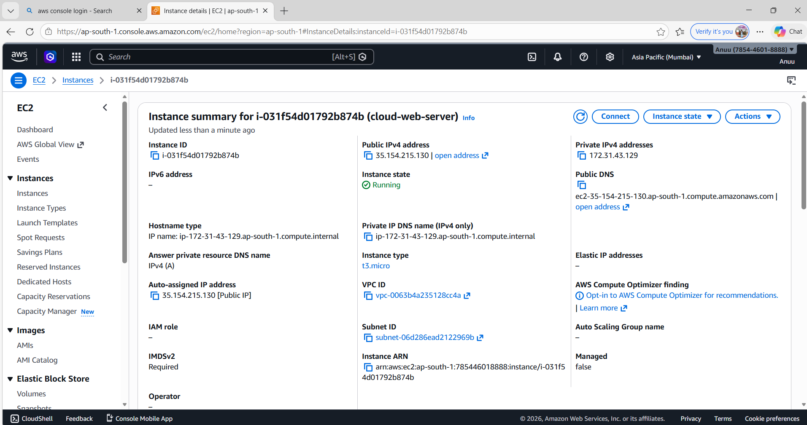
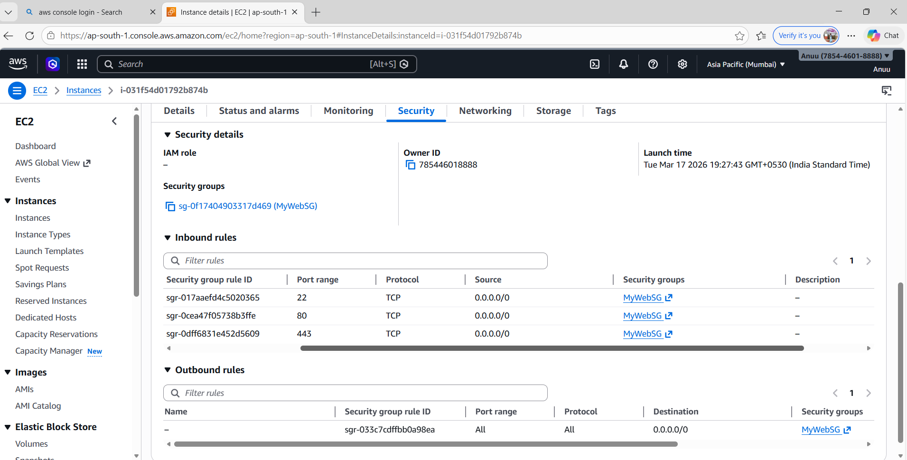
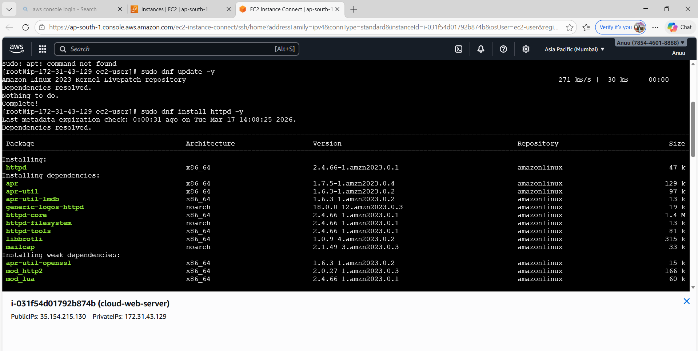
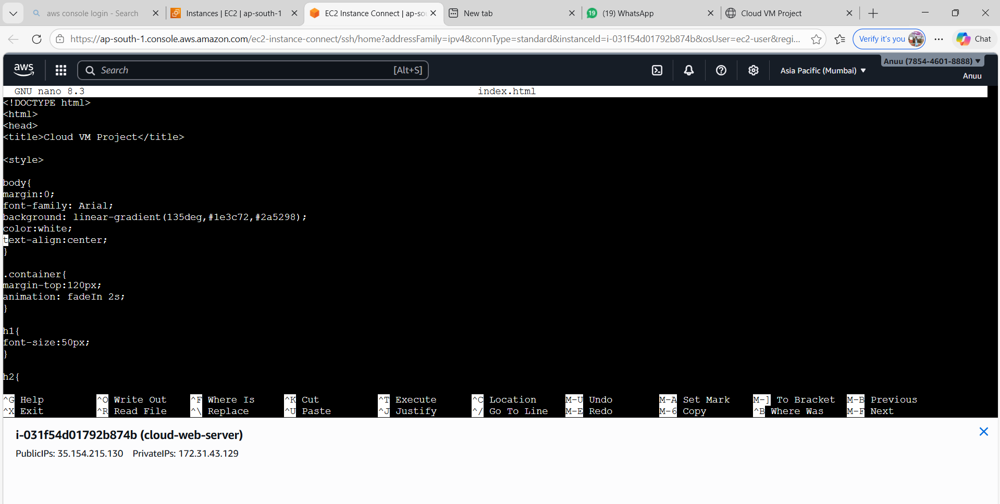
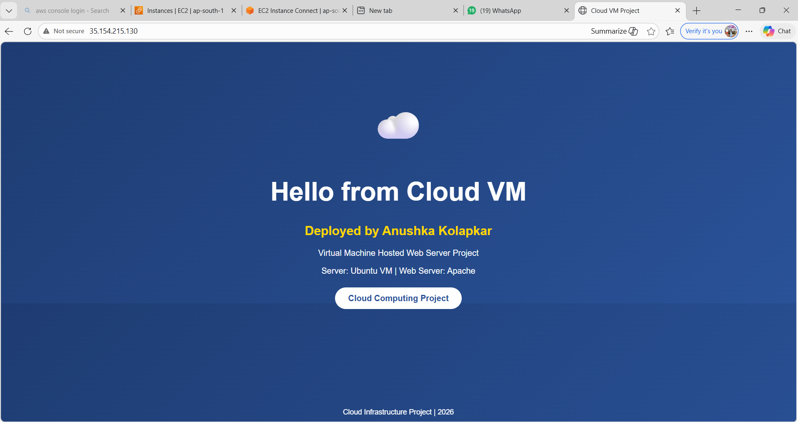

# ☁ AWS EC2 Web Server Hosting Project

## 👩‍💻 Author
Anushka Kolapkar

---

## 📌 Project Overview
This project demonstrates how to deploy a virtual machine using AWS EC2 and host a website using a web server.

The website is hosted on a cloud-based virtual machine and is accessible using the public IP address.

---

## 🚀 Technologies Used

- AWS EC2
- Amazon Linux 2023
- Apache Web Server
- HTML
- Cloud Computing

---

## 📂 Project Structure

aws-ec2-web-server-project

index.html  
screenshots/

---

## ⚙️ Steps Performed

### 1. Created EC2 Instance
A virtual machine was launched using AWS EC2 with Amazon Linux 2023.


### 2. Configured Security Group
Inbound rules were added:
- SSH (Port 22)
- HTTP (Port 80)
  HTTPS(Port 443)
  
  
### 3. Connected to Instance
Connected using EC2 Instance Connect terminal.

### 4. Installed Apache Web Server

```bash
sudo dnf update -y
sudo dnf install httpd -y
```


### 5. Started Web Server

```bash
sudo systemctl start httpd
sudo systemctl enable httpd
```
### 6. Deployed website

```bash
cd /var/www/html
sudo nano index.html ( Add the index.html code )
-to exit = ctrl+x
         = y
         = enter
```

---

## 🌐 Live Website
Hosted using AWS EC2 Public IP:
http://35.154.215.130



---

## 📚 Learning Outcome
-Understanding cloud virtual machines
-Hosting websites on EC2
-Configuring web servers
-Managing security groups in AWS

---

## ☁ Cloud Computing Project
This project was created to understand AWS EC2 services and web server deployment in cloud computing.
